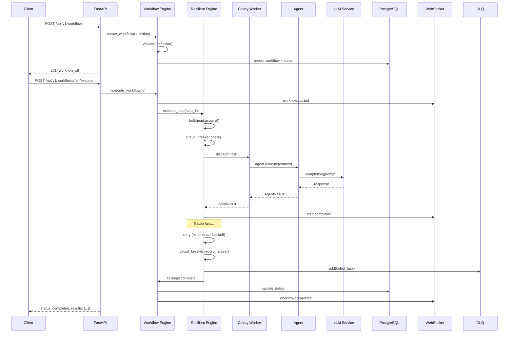
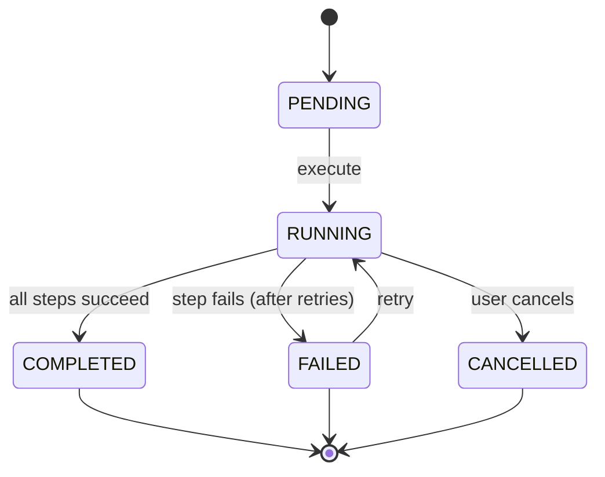
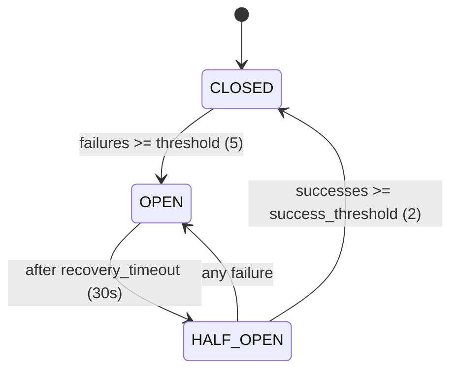

# Architecture

## System Overview

AgentFlow is a distributed AI agent orchestration platform built on four core design principles:

1. **Async-first** — Non-blocking I/O throughout the stack (FastAPI, asyncpg, async Celery)
2. **Resilience by default** — Every agent execution is wrapped in retry, circuit breaker, and bulkhead patterns
3. **Observable** — Every request, workflow, and agent call produces traces, metrics, and structured logs
4. **Horizontally scalable** — Stateless API and worker processes scale independently behind a shared PostgreSQL + Redis layer

## Component Architecture

```mermaid
graph TB
    subgraph Client Layer
        Browser[Browser / API Client]
    end

    subgraph API Layer
        FASTAPI[FastAPI Application]
        CORS[CORS Middleware]
        TRACE_MW[Tracing Middleware]
        LOG_MW[Logging Middleware]
        METRIC_MW[Metrics Middleware]

        FASTAPI --> CORS --> TRACE_MW --> LOG_MW --> METRIC_MW
    end

    subgraph Route Handlers
        HEALTH[/health, /health/ready]
        WORKFLOWS[/workflows CRUD + execute]
        AGENTS[/agents management]
        DASHBOARD[/dashboard stats]
        WEBSOCKET[/ws real-time events]
    end

    subgraph Core Engine
        ORCH[Orchestrator]
        ENGINE[Workflow Engine]
        RESILIENT[Resilient Engine]
        STATE[State Machine]
    end

    subgraph Fault Tolerance
        RETRY[Retry Executor]
        CB[Circuit Breaker]
        BH[Bulkhead]
        DLQ[Dead Letter Queue]
    end

    subgraph Agent Layer
        FACTORY[Agent Factory]
        RESEARCH[Research Agent]
        ANALYSIS[Analysis Agent]
        WRITER[Writer Agent]
        CODE[Code Agent]
    end

    subgraph Services
        LLM[LLM Service - LiteLLM]
    end

    subgraph Infrastructure
        PG[(PostgreSQL 16)]
        REDIS[(Redis 7)]
        CELERY[Celery Workers]
        PROM[Prometheus]
        GRAF[Grafana]
        OTEL_COL[OTEL Collector]
    end

    Browser --> FASTAPI
    METRIC_MW --> HEALTH & WORKFLOWS & AGENTS & DASHBOARD & WEBSOCKET

    WORKFLOWS --> ORCH --> ENGINE --> RESILIENT
    RESILIENT --> STATE
    RESILIENT --> BH --> CB --> RETRY
    RETRY -->|exhausted| DLQ
    RESILIENT --> FACTORY --> RESEARCH & ANALYSIS & WRITER & CODE
    RESEARCH & ANALYSIS & WRITER & CODE --> LLM

    ENGINE --> CELERY
    CELERY --> REDIS
    WORKFLOWS --> PG
    FASTAPI -->|/metrics| PROM --> GRAF
    FASTAPI --> OTEL_COL
```

## Data Flow

### Workflow Lifecycle



### State Machine

Workflows and steps follow a strict state machine with validated transitions:



Step-level states include an additional `SKIPPED` state for steps that cannot execute due to upstream failures.

## Fault Tolerance Design

AgentFlow implements four complementary resilience patterns. In the `ResilientWorkflowEngine`, these are composed as layers around every agent execution:

```
Request → Bulkhead → Circuit Breaker → Retry → Agent.execute()
```

### Retry Pattern

Handles transient failures with exponential backoff and jitter.

```
delay = min(base_delay * (exponential_base ^ attempt), max_delay)
jitter = random(0, 0.5 * delay)
actual_delay = delay + jitter
```

| Parameter | Default | Description |
|---|---|---|
| `max_retries` | 3 | Maximum retry attempts |
| `base_delay` | 1.0s | Initial backoff delay |
| `max_delay` | 60.0s | Maximum backoff delay |
| `exponential_base` | 2.0 | Backoff multiplier |
| `jitter` | true | Randomized delay to prevent thundering herd |

When retries are exhausted, a `RetryExhaustedError` is raised and the task is sent to the dead-letter queue.

### Circuit Breaker Pattern

Prevents cascading failures by short-circuiting calls to failing services.



| Parameter | Default | Description |
|---|---|---|
| `failure_threshold` | 5 | Consecutive failures before opening |
| `recovery_timeout` | 30.0s | Wait time before probing |
| `half_open_max_calls` | 3 | Concurrent calls allowed during probe |
| `success_threshold` | 2 | Consecutive successes to close |

When open, the circuit breaker raises `CircuitOpenError` immediately without executing the call.

### Bulkhead Pattern

Limits concurrency to prevent resource exhaustion. Uses an asyncio semaphore with a bounded queue.

| Parameter | Default | Description |
|---|---|---|
| `max_concurrent` | 10 | Maximum concurrent executions |
| `max_queue_size` | 100 | Maximum queued requests |
| `timeout` | 30.0s | Queue wait timeout |

Raises `BulkheadFullError` when both the execution pool and queue are full, or when a request times out waiting.

### Dead Letter Queue

In-memory store for tasks that have exhausted all retries. Each entry captures:

- Task ID and workflow ID
- Error message and full payload
- Retry count and timestamp
- Whether max retries were reached

Entries can be inspected through the dashboard DLQ viewer and retried manually. Maximum capacity: 10,000 entries.

## Observability Strategy

### Three Pillars

```mermaid
graph LR
    subgraph Application
        API[FastAPI]
        Workers[Celery Workers]
        Agents[Agents]
    end

    subgraph Tracing
        OTEL[OpenTelemetry SDK]
        OTLP[OTLP Exporter]
    end

    subgraph Metrics
        PROM_CL[prometheus_client]
        ENDPOINT[/metrics endpoint]
        PROM_SRV[Prometheus Server]
    end

    subgraph Logging
        SLOG[structlog]
        JSON[JSON Output]
    end

    subgraph Visualization
        GRAF[Grafana]
    end

    API & Workers & Agents --> OTEL --> OTLP
    API & Workers & Agents --> PROM_CL --> ENDPOINT --> PROM_SRV
    API & Workers & Agents --> SLOG --> JSON

    PROM_SRV --> GRAF
    OTLP --> GRAF
```

**Tracing**: Every HTTP request and workflow step gets an OpenTelemetry span. The `@traced` decorator automatically captures function arguments, `workflow_id`, and `step_id` as span attributes. Spans are exported via OTLP gRPC with a `BatchSpanProcessor` to minimize overhead.

**Metrics**: Prometheus counters, histograms, and gauges covering workflows, agents, fault tolerance state, and HTTP requests. The `MetricsCollector` singleton exposes all metrics at `/metrics`. Scrape interval: 15 seconds.

**Logging**: structlog with JSON output in production, console output in development. Every log entry includes the OpenTelemetry `trace_id` and `span_id` for correlation across the three pillars.

## Scalability Considerations

### Horizontal Scaling

| Component | Scaling Strategy |
|---|---|
| **API** | Stateless — scale replicas behind a load balancer |
| **Celery Workers** | Stateless — scale based on queue depth |
| **PostgreSQL** | Vertical scaling + read replicas for queries |
| **Redis** | Redis Cluster for high availability |

### Performance Tuning

- **Connection pooling**: SQLAlchemy pool with `pool_size=20`, `max_overflow=10`
- **Task prefetch**: `worker_prefetch_multiplier=1` for fair distribution across workers
- **Batch processing**: OpenTelemetry `BatchSpanProcessor` for efficient trace export
- **Bulkhead isolation**: Prevents a single slow agent from consuming all worker capacity
- **Celery queues**: Three dedicated queues (`default`, `workflows`, `agents`) for priority isolation

### Bottleneck Analysis

- **LLM API calls** are the primary latency bottleneck. Mitigated by parallel step execution, retries with backoff, and circuit breaker to fail fast when a provider is down.
- **Database connections** can saturate under high workflow volume. Connection pooling and async drivers minimize impact.
- **Redis** is used for both Celery broker and result backend. In high-throughput deployments, separate Redis instances are recommended.

## Security Considerations

- **Secrets management**: API keys and database credentials are injected via environment variables, never hardcoded
- **CORS**: Restrictive in production (empty `allow_origins`), permissive only when `DEBUG=true`
- **Non-root containers**: Docker images run as `appuser` (UID 1000)
- **Task time limits**: Celery enforces soft (300s) and hard (600s) time limits to prevent runaway tasks
- **Input validation**: Pydantic v2 validates all API inputs with strict type checking
- **SQL injection**: SQLAlchemy ORM with parameterized queries throughout
- **Authentication**: API key header support is configured (`X-API-Key`) — full authentication middleware is planned for a future release
